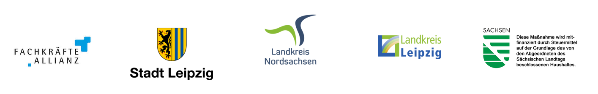

# .github
</> HRML

  Es handelt sich um ein Projekt der Fachkräfteallianz Leipzig, Nordsachsen und Leipziger Land. 
  Diese Maßnahme wird mitfinanziert mit Steuermitteln auf Grundlage des vom Sächsischen Landtag beschlossenen Haushaltes.

  

